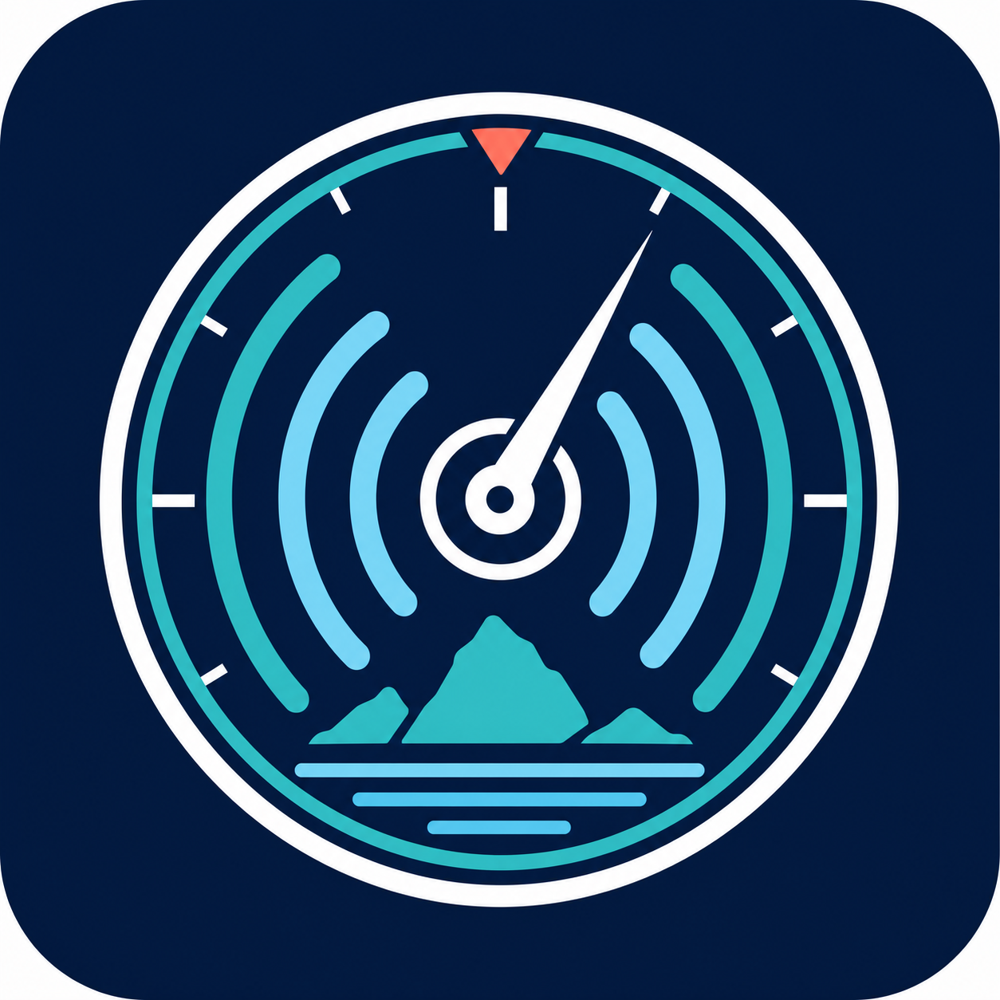

# Bermuda Tuner

<p align="center">
  <a href="https://github.com/ComputerWhisperers/bermuda_tuner/releases/latest"></a>
  <a href="https://github.com/ComputerWhisperers/bermuda_tuner/actions/workflows/validate.yml"></a>
  <a href="https://github.com/ComputerWhisperers/bermuda_tuner/actions/workflows/hassfest.yml"></a>
  <a href="https://hacs.xyz/"></a>
  <a href="https://www.home-assistant.io/"></a>
  <a href="LICENSE"></a>
</p>

<p align="center"></p>

Bermuda Tuner is a separate HACS integration that helps beginners audit and tune
[Bermuda](https://github.com/agittins/bermuda) from inside Home Assistant. Its
calculations are deterministic; optional AI only explains a redacted report through a
Home Assistant Conversation agent selected by the user.

## What it does

- **Setup audit:** flags stale scanner relationships, weak overlap, and unstable RSSI.
- **One-metre calibration:** uses the median and spread of Bermuda RSSI history to recommend `ref_power`.
- **Distance calibration:** calculates attenuation from a measured test beyond one metre; 4-6 m is a useful practical range.
- **Scanner balancing:** aligns per-scanner medians and recommends RSSI offsets.
- **Walk test:** reports nearest and second-nearest scanners, signal margin, and ambiguity.
- **Plain-English settings:** explains smoothing, velocity, radius, updates, and away timeout.
- **Apply and rollback:** previews supported option changes, snapshots Bermuda options, and restores the latest snapshot.
- **Diagnostics:** exports a redacted report without MAC addresses or IRKs.

## Requirements

- Home Assistant 2024.6 or newer
- Bermuda installed and configured
- HACS for the recommended installation method

## Installation

1. In HACS, add `https://github.com/ComputerWhisperers/bermuda_tuner` as a custom integration repository.
2. Download **Bermuda Tuner** and restart Home Assistant.
3. Open **Settings > Devices & services > Add integration** and select **Bermuda Tuner**.

## Guided workflow

Open **Developer tools > Actions**, search for `Bermuda Tuner`, and run the actions in
this order. Every analysis action returns structured response data that Home Assistant
can display or capture in a script response variable.

1. Run **Setup audit**.
2. Put a beacon one metre from a scanner and run **One-metre calibration**.
3. Move it to a measured distance beyond one metre and run **Distance calibration**.
4. Keep the beacon still and run **Balance scanners**.
5. Walk between areas while repeatedly running **Walk test**.
6. Run **Preview settings**, inspect the changes, then run **Apply settings**.
7. Use **Roll back** to restore the previous snapshot if behavior gets worse.

Example script:

```yaml
sequence:
  - action: bermuda_tuner.audit
    response_variable: audit
  - action: persistent_notification.create
    data:
      title: Bermuda audit
      message: "{{ audit.summary | join(' ') }}"
```

## Supported option patch

`preview` and `apply` accept an object containing only Bermuda's documented tuning keys:

```yaml
action: bermuda_tuner.preview
data:
  settings:
    ref_power: -59
    attenuation: 2.7
    smoothing_samples: 15
response_variable: preview
```

Supported keys are `ref_power`, `attenuation`, `rssi_offsets`, `smoothing_samples`,
`max_velocity`, `max_area_radius`, `update_interval`, and
`devtracker_nothome_timeout`.

## AI and privacy

AI is off by default. The tuner performs all measurements and recommendations locally.
When **Ask AI** is invoked, it creates an audit, removes MAC addresses and 32-character
IRKs again as defense in depth, and sends only that report to the selected Home Assistant
Conversation agent. The tuner stores no AI transcript and has no API key setting.

The selected Conversation provider may retain data under its own policy. Use a local
Conversation agent when no cloud transmission is acceptable. Diagnostics never invoke AI.

## Safety

Apply updates only documented Bermuda options and creates a local snapshot first. It does
not write Bermuda internals or Bluetooth identifiers. Review every preview, change one
variable at a time when possible, and use rollback if tracking quality declines.

## License

[MIT](LICENSE)
